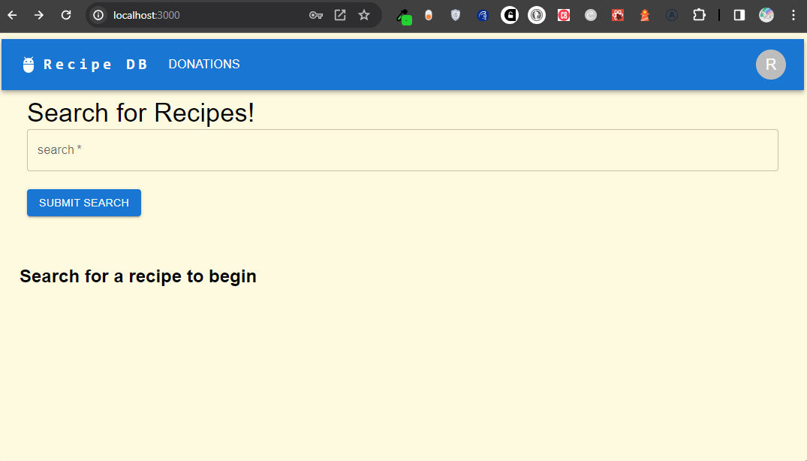
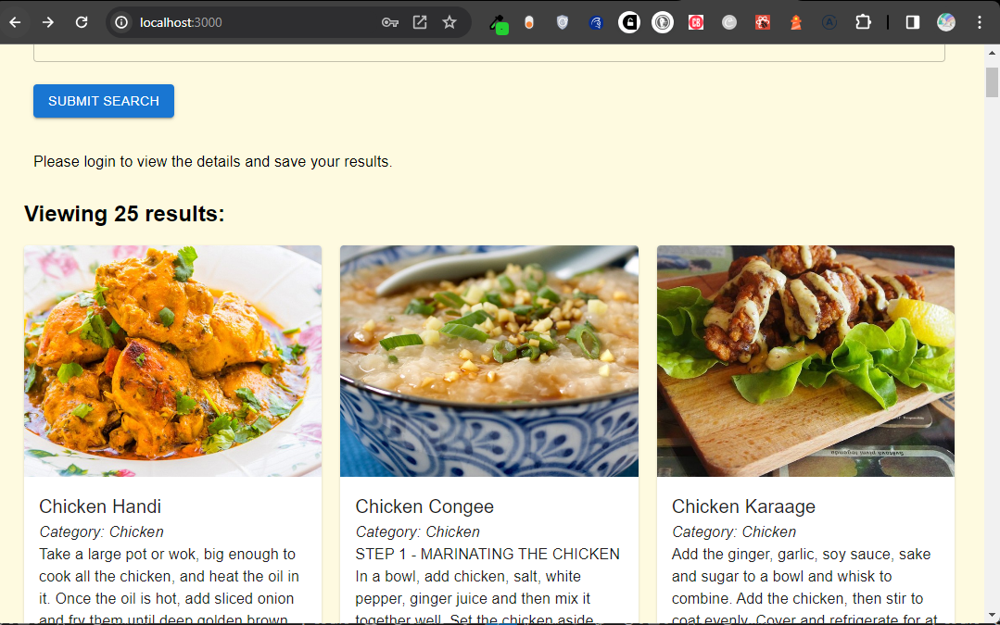
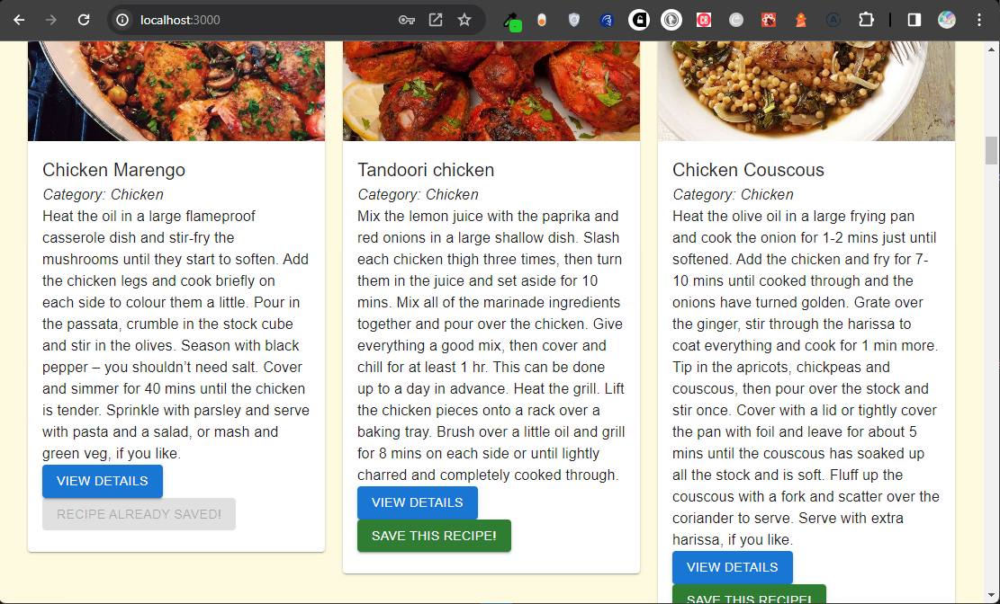
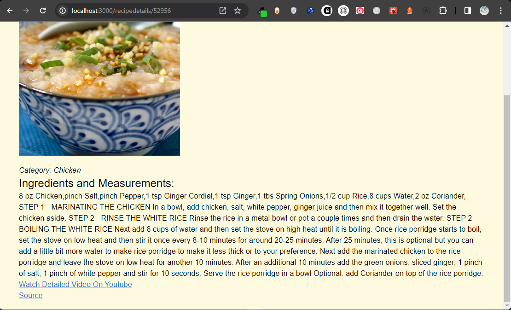
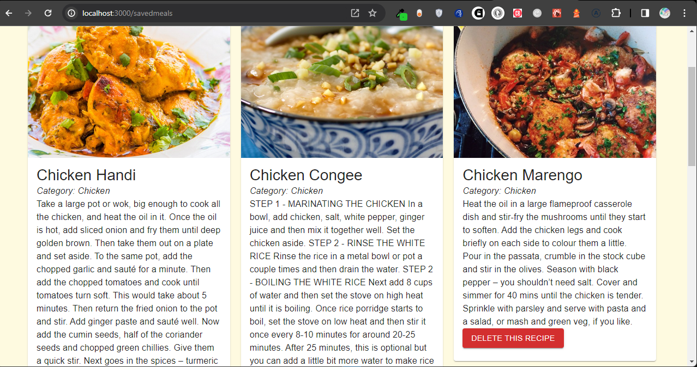

# 23 Final Project: MERN Stack Single-Page Application

## Description

Projects have played a key role in your journey to becoming a full-stack web developer. As you apply for development jobs, your portfolio is absolutely vital to opening doors to opportunities. Your portfolio showcases high-quality deployed examples of your work, and you can use your finished projects for that very purpose.

This project is a fantastic opportunity to show employers your collaborative skills and coding abilities, especially in the context of a scalable, user-focused MERN app. Remember that employers want to see what you can do, but they also want to see how you work with other developers. The more examples of deployed collaborative work you have in your portfolio, the more likely you are to get an interview and a job.

## Motivation

I was motivated to complete this assignment to learn more about the popular technology architecture known as MERN stack: front end, back end, and database using GraphQL, Apollo server, JavaScript and JSON. MERN stands for MongoDB, Express, React, Node, after the four key technologies that make up the stack. This is a popular and powerful stack for building full-stack web applications.

## Mock-Up

The following screenshot shows the web application's appearance and functionality:

Recipe Search Engine

## Why

I created this project because I wanted to further challenge myself while learning more about MERN stack, GraphQL, and Apollo server. I wanted to learn how to use GraphQL and apollo server to query and manipulate data, streamlining data fetching and management, reducing the requests on the server and increasing speed. This inlcudes a strongly typed API with schema validation, state management in client applications, and enhanced security with controlled data access. I wanted to learn how MongoDB works extremely well with Node.js, and makes storing, manipulating, and representing JSON data at every tier of your application incredibly easy. For cloud-native applications.

## What problem does it solve?

This project solves the problem of having to search for your favorite recipe when you just cant figure out what to make for your next meal. This project solves the problem of having to make multiple requests to the server to get the data you need. GraphQL and apollo server allows you to query and manipulate data, streamlining data fetching and management, reducing the requests on the server and increasing speed. This is a lightweight alternative to REST for client-server communication. It also solves the problem of having to use multiple technologies to create a full stack application.

## What did you learn

I learned how to use GraphQL and apollo server to query and manipulate data, using a well structured model to define the data in the database, and a schema to define the data types for the queries and mutations. I learned how to use GraphQL and apollo server to streamlining data fetching and management, reducing the requests on the server and increasing speed. I learned about react and using Type Definitions with Apollo Server: Defining data types and operations in the GraphQL schema. This helps in managing how data is fetched and manipulated, providing a clear structure to your application's data.
Creating a Global Store: This can be done using the Context API or Redux. A global store holds the state of your application in a central place, making it accessible throughout the app. Redux is particularly powerful for complex applications, as it provides a more structured approach to state management compared to the Context API.
Refactoring an App to Use Redux: To shift from Context API to Redux, you need to set up a Redux store, define reducers and actions, and replace Context API calls with Redux hooks (useDispatch and useSelector) in your components. This allows for more robust state management, especially for larger and more complex applications. 

I learned why MERN  For cloud-native applications, MongoDB Atlas provides a fully managed database as a service. I learned how to use MongoDB Atlas to create a database, connect to it, and perform CRUD operations.

## What makes your project stand out?

My project stands out because it uses GraphQL, apollo server, MERN stack, MongoDB Atlas with cloud accessability, and is deployed on render, and netlify. Incorporating Apollo Server and GraphQL into a MERN stack application with MongoDB Atlas provides a robust, efficient, and developer-friendly environment. It enhances the application's scalability, maintainability, and performance, making it a compelling choice for modern web application development.

## Installation

first type npm install in the terminal, then npm run develop in the terminal to start the server.

## Usage

You can use this web application to sign up/login as a user then search for recipes, view details about the recipes you have searched for populating links to the source and a detailed youtube video to display how to prepare this recipe, save the recipes you have searched for, and delete recipes you have searched for. You can also make donations to the site.

Page Load

Search for Recipes

Save Recipe Searches

View Details of a Recipe Search

Delete Recipe Searches

### Link to github repo

<https://github.com/precisecoding/recipe-mern>

### Deployed link

Deployed on render.com:
<https://recipedb-ug34.onrender.com>

Deployed on netlify:
[Netlify Deployed Link](https://recipedbmernstack.netlify.app/)

Netlify Link:
https://recipedbmernstack.netlify.app/ 

### This site was built using netlify and render

Render:
<https://render.com/>

Netlify:
<https://netlify.com>

MongoDB Atlas:
<https://www.mongodb.com/atlas/database>

Apollo Server/GraphQL:
<https://www.apollographql.com/docs/react/>

### License

MIT License:
<https://opensource.org/licenses/MIT>
<https://choosealicense.com/licenses/mit/>
LICENSE file included in repository.

### Thanks to everyone for support and contributions

Sources used: <https://developer.mozilla.org/en-US/>, <https://www.w3schools.com/>, <https://stackoverflow.com/>